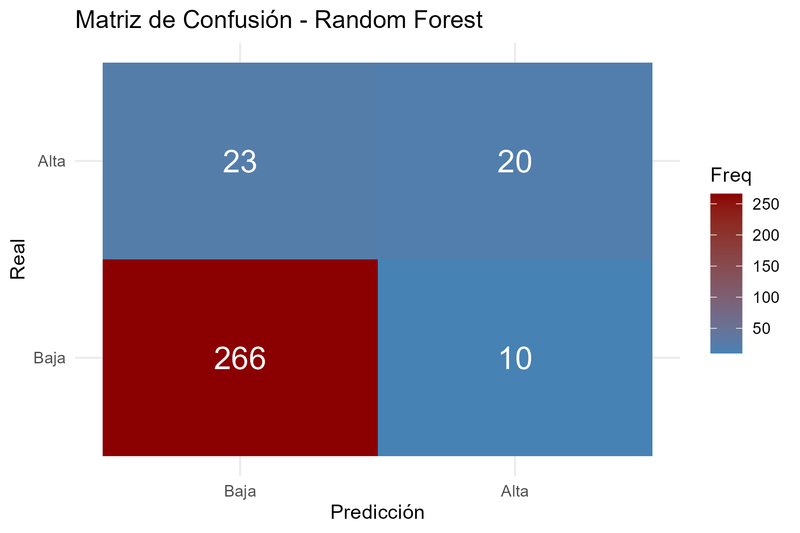

# Random Forest - Clasificación de Calidad de Vinos

Este proyecto aplica un modelo de Random Forest en R para predecir si un vino tinto tiene **alta o baja calidad**, utilizando el [dataset público de vinos de la UCI](https://archive.ics.uci.edu/dataset/186/wine+quality). Se incluyen análisis exploratorio, entrenamiento del modelo, evaluación y visualizaciones de los resultados.

## 📁 Estructura del Proyecto
```text
random-forest-wine/
├── data/
│ └── winequality-red.csv # Dataset original
├── img/
│ ├── confusion_matrix.png # Matriz de confusión
│ ├── feature_importance.png # Gráfico de importancia de variables
├── scripts/
│ └── random_forest_model.R # Script principal en R
├── README.md # Este archivo
```

## 📊 Descripción del Dataset

- **Fuente:** [UCI Machine Learning Repository](https://archive.ics.uci.edu/ml/datasets/Wine+Quality)
- **Instancia:** 1599 vinos tintos
- **Variables:** 11 características físico-químicas (pH, alcohol, acidez, etc.) + `quality` (calificación de 0 a 10)

```text
fixed acidity, volatile acidity, citric acid, residual sugar, chlorides,
free sulfur dioxide, total sulfur dioxide, density, pH, sulphates, alcohol, quality
```

## Objetivo
El objetivo es entrenar un modelo de clasificación que prediga si un vino es de alta calidad (calidad >= 7) o baja calidad (calidad < 7), en base a sus características físico-químicas.

## Metodología

## 📈 Resultados
> A continuación se muestran algunos resultados obtenidos por el modelo entrenado usando set.seed(123):

### Matriz de confusión


### Importancia de variables


### AUC
```r
> cat("AUC:", auc(roc_obj), "\n")
AUC: 0.9092518 
```

## Librerías utilizadas

> En caso de no tener alguna, instalar con install.packages(libreria)

- tidyverse
- caret
- randomForest
- pROC
